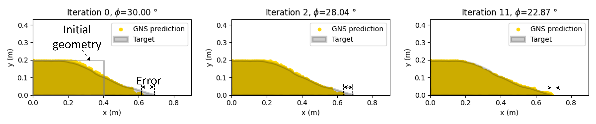
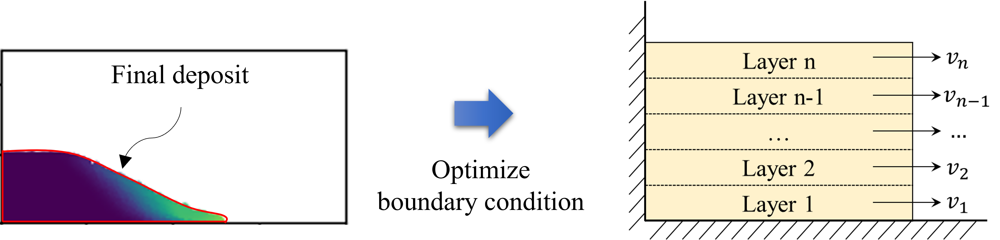
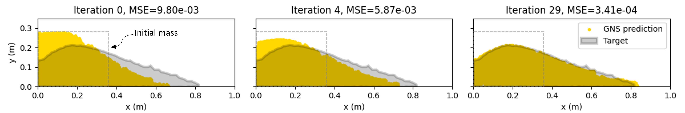
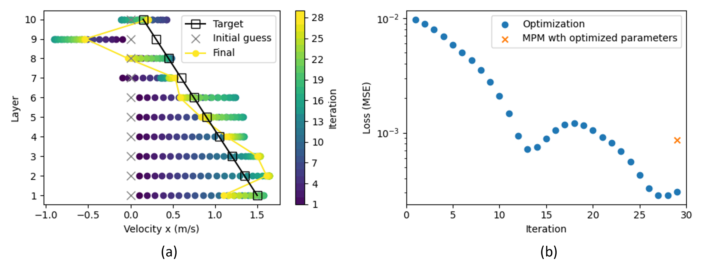
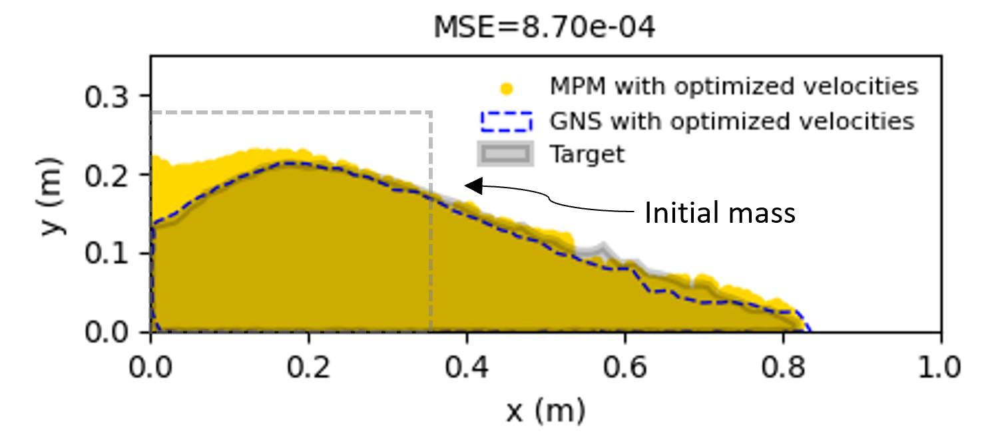
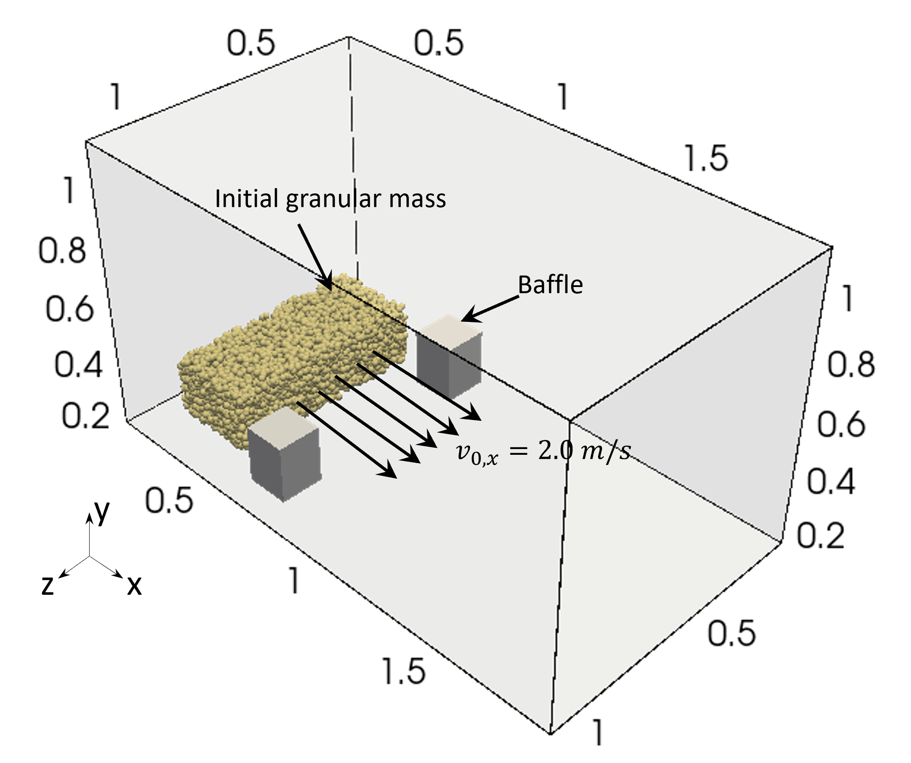
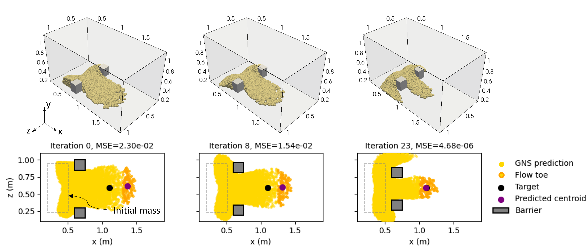
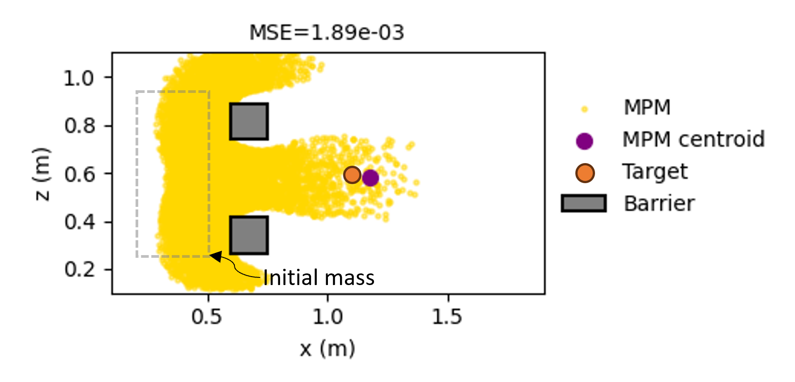

# Solving inverse problems using differentiable graph neural network simulator (GNS)
Inverse problems in granular flows, such as landslides and debris flows, involve estimating material
parameters or boundary conditions based on target runout profile. We propose a novel
differentiable graph neural network simulator (GNS) by combining reverse mode automatic differentiation (AD)
of graph neural networks with gradient-based optimization for solving inverse problems in 
granular flows. This repository shows provides examples of solving inverse problems using 
the proposed method (AD-GNS). 

## Set up
### Clone the repository
```shell
git clone https://github.com/geoelements/gns-inverse-examples.git
```
The current GNS code in this repository is based on
[this specific version](https://github.com/geoelements/gns/tree/4f6a4a4aa58f8de37bf29df2cf2e0cae4154cd81).
More recent versions of GNS might not work.

### Build virtual environment on TACC LS6
* SSH to TACC LS6 GPU node.
* Set up a virtualenv:
```shell
source build_venv.sh
```
* Check tests run successfully.
* Start your virtual env: 
```shell
source start_venv.sh
```


## Example (a): Single parameter inverse
This example demonstrates single parameter inverse of determining material property
(friction angle ($\phi$)) based on the final runout. We aim to estimate the friction
angle $\phi$ of the granular column that produces a target runout distance.

### Required data
To run the inverse analysis, the `data` and `simulator` files should be located 
in `./inverse_friction/` directory. We shared these files [here](https://doi.org/10.17603/ds2-0wjq-0j84).

### Run
To carry out the inverse,
```shell
python3 inverse_friction/inverse.py --input_path="inverse_friction/data/<scenario>/<configuration>"
```
* We provide four different inverse analysis scenarios, 
`short_phi21`, `short_phi42`, `tall_phi21`, `tall_phi42`, which can be entered in 
`<scenario>` in the above command line. 

* We also provide two differentiation methods
for conducting gradient-based optimization: 
reverse-mode automatic differentiation (AD), which is our proposed approach,
and finite differentiation (FD). The differentiation methods can be specified by
changing the option in the configuration file, or simply use 
`config_ad.json` or `config_fd.json` files provided in `inverse_friction/data/`.
These config file names can be entered in `<configuration>` in the above command line.

### Result

* Optimization history for `short_phi21`. The target is $\phi=21\degree$:




## Example (b): Multi-parameter inverse
Real-world inverse problems are complex as they include 
multiple parameters for optimization. This example demonstrates 
multi-parameter inverse of evaluating the initial boundary conditions.
The objective is to determine the initial boundary condition, i.e., x-velocities ($\boldsymbol{v}$), 
of each layer in the multi-layered granular column that produces a target runout deposit.



### Required data
Similar to `inverse_friction`, to run the inverse analysis, 
the `data` and `simulator` files should be located 
in `./Inverse_velocity/` directory. We shared these files [here](https://doi.org/10.17603/ds2-0wjq-0j84).

### Run
To carry out the inverse,
```shell
python3 inverse_velocity/inverse.py --input_path="inverse_velocity/config.json>"
```
### Result

* Optimization history:





* MPM simulation results of the final deposit from the optimized velocities and target velocities:
<p align="center">
  
</p>


## Example (c): Design of baffles to resist debris flow
Our AD-GNS can be used for designing engineering structures, which involves optimizing the design
parameters of structural systems to achieve a specific functional outcome. This example 
demonstrate the use of AD-GNS in the design of the debris-resisting baffles to achieve 
a target runout distance. Our inverse analysis aims to optimally position the baffles to halt 
granular flow within a predefined area.

<p align="center">
  
</p>


### Required data
Similar to the previous cases, to run the inverse analysis, 
the `data` and `simulator` files should be located 
in `./Inverse_barrier/` directory. We shared these files [here](https://doi.org/10.17603/ds2-0wjq-0j84).

### Run
To carry out the inverse,
```shell
python3 inverse_velocity/inverse.py --input_path="inverse_barrier/config.json>"
```

### Result
* Optimization history:



* MPM simulation results of final deposit from the inferred baffle locations and its
flow toe centroid compared to the target:

<p align="center">
  
</p>


